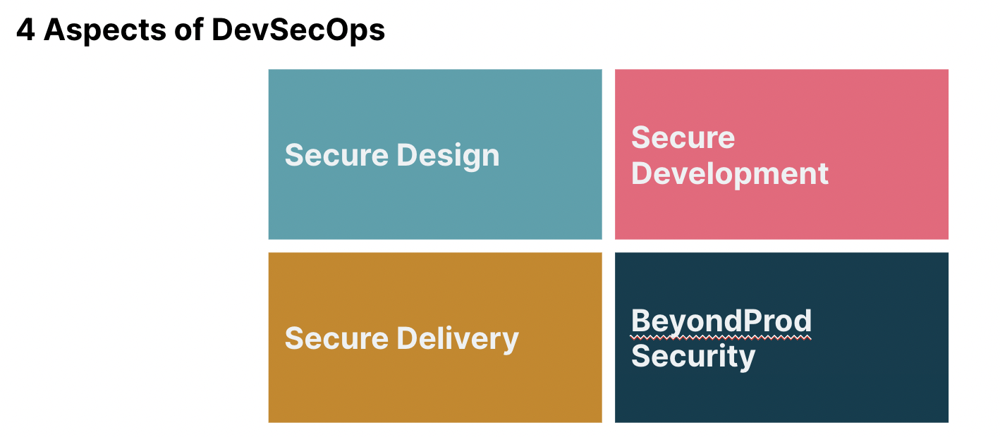

# DevSecOps

## DevSecOps - Security is everyone's responsibility.

The goal of DevSecOps is to bring individuals of all abilities to a high level of proficiency in security in a short period of time.

<figure><figcaption></figcaption></figure>


**NOTE:** This playbook is generated based on my knowledge and experiences. You are free to use the playbook contents.  Contributions are welcome.

